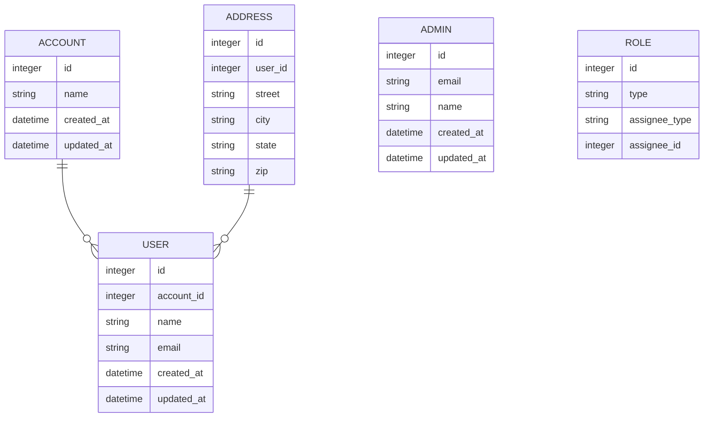

```mermaid
erDiagram
ACCOUNT {
	integer id
	string name
	datetime created_at
	datetime updated_at
}

ADDRESS {
	integer id
	integer user_id
	string street
	string city
	string state
	string zip
}

ADMIN {
	integer id
	string email
	string name
	datetime created_at
	datetime updated_at
}

ROLE {
	integer id
	string type
	string assignee_type
	integer assignee_id
}

USER {
	integer id
	integer account_id
	string name
	string email
	datetime created_at
	datetime updated_at
}

ACCOUNT ||--o{ USER : ""
ADDRESS ||--o{ USER : ""
```
